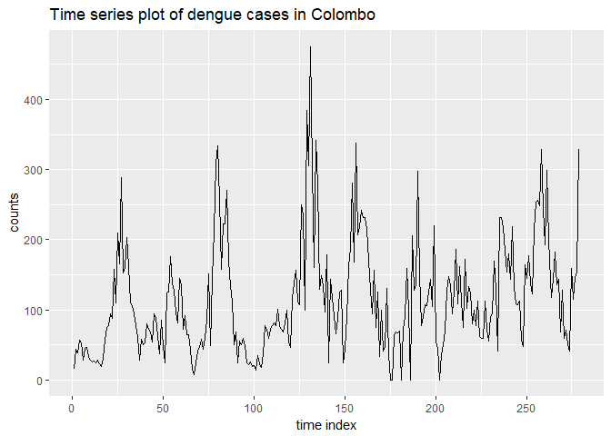

mozzie 

[](https://cran.r-project.org/) [](https://cran.r-project.org/package=mozzie) [](commits/master)

------------------------------------------------------------------------

[](/commits/master) [](http://www.repostatus.org/#active) [](http://choosealicense.com/licenses/cc0-1.0/) [](https://travis-ci.org/thiyangt/mozzie) [](http://www.rdocumentation.org/packages/mozzie)

<!-- README.md is generated from README.Rmd. Please edit that file -->
mozzie
======

R package for weekly notified dengue cases in Sri Lanka

Installation
------------

You can install mozzie from CRAN with:

``` r
install.packages("mozzie")
```

You can install mozzie from github with:

``` r
# install.packages("devtools")
devtools::install_github("thiyangt/mozzie")
```

Examples
--------

This is a basic example which shows you how to solve a common problem:

``` r
## basic example code
library(mozzie)
head(mozzie)
#>   ID Year Week Colombo Gampaha Kalutara Kandy Matale Nuwara Eliya Galle
#> 1  1 2008   52      15       7        1    11      4            0     0
#> 2  2 2009    1      44      23        5    16     21            2     0
#> 3  3 2009    2      39      19       11    42      9            1     2
#> 4  4 2009    3      57      23       12    28      3            2     1
#> 5  5 2009    4      53      24       19    32     20            2     2
#> 6  6 2009    5      29      17       10    21      6            0     3
#>   Hambantota Matara Jaffna Kilinochchi Mannar Vavuniya Mulative Batticalo
#> 1          6     22      0           0      8        0        0         1
#> 2          5     18      1           0      0        0        0         0
#> 3          3     18      1           0      0        0        0         0
#> 4          4     15      0           0      1        0        0         2
#> 5          7     15      0           0      1        2        0         1
#> 6          3      8      0           0      0        0        0         4
#>   Ampara Trincomalee Kurunagala Puttalam Anuradhapura Polonnaruwa Badulla
#> 1      0           0          2        1            2           0       1
#> 2      1           1         10        5            0           0       1
#> 3      0           0         10        2            0           0       1
#> 4      3           0          5        2            2           3       4
#> 5     11           0         25        0            2           1       3
#> 6     14           6         17        1            2           2       2
#>   Monaragala Ratnapura Kegalle
#> 1          1         2      16
#> 2          0         1      25
#> 3          0         2      21
#> 4          1         5      15
#> 5          2         2      14
#> 6          1         7      17
```

``` r
summary(mozzie)
#>        ID             Year           Week          Colombo     
#>  Min.   :  1.0   Min.   :2008   Min.   : 1.00   Min.   :  0.0  
#>  1st Qu.: 70.5   1st Qu.:2010   1st Qu.:12.00   1st Qu.: 57.0  
#>  Median :140.0   Median :2011   Median :24.00   Median : 99.0  
#>  Mean   :140.0   Mean   :2011   Mean   :25.37   Mean   :115.6  
#>  3rd Qu.:209.5   3rd Qu.:2012   3rd Qu.:39.00   3rd Qu.:154.0  
#>  Max.   :279.0   Max.   :2014   Max.   :53.00   Max.   :475.0  
#>     Gampaha         Kalutara         Kandy            Matale      
#>  Min.   :  0.0   Min.   : 0.00   Min.   :  0.00   Min.   :  0.00  
#>  1st Qu.: 26.5   1st Qu.:11.00   1st Qu.: 11.00   1st Qu.:  3.50  
#>  Median : 46.0   Median :21.00   Median : 25.00   Median :  7.00  
#>  Mean   : 56.2   Mean   :22.52   Mean   : 30.72   Mean   : 12.21  
#>  3rd Qu.: 80.0   3rd Qu.:33.00   3rd Qu.: 39.00   3rd Qu.: 13.00  
#>  Max.   :256.0   Max.   :75.00   Max.   :217.00   Max.   :130.00  
#>   Nuwara Eliya        Galle         Hambantota         Matara     
#>  Min.   : 0.000   Min.   : 0.00   Min.   : 0.000   Min.   : 0.00  
#>  1st Qu.: 1.000   1st Qu.: 5.00   1st Qu.: 3.000   1st Qu.: 5.00  
#>  Median : 3.000   Median :11.00   Median : 6.000   Median :10.00  
#>  Mean   : 4.147   Mean   :13.75   Mean   : 9.423   Mean   :14.86  
#>  3rd Qu.: 5.500   3rd Qu.:19.50   3rd Qu.:11.500   3rd Qu.:19.00  
#>  Max.   :24.000   Max.   :70.00   Max.   :87.000   Max.   :76.00  
#>      Jaffna        Kilinochchi        Mannar          Vavuniya      
#>  Min.   :  0.00   Min.   :0.000   Min.   : 0.000   Min.   :  0.000  
#>  1st Qu.:  2.50   1st Qu.:0.000   1st Qu.: 0.000   1st Qu.:  0.000  
#>  Median :  8.00   Median :0.000   Median : 1.000   Median :  1.000  
#>  Mean   : 14.82   Mean   :0.509   Mean   : 2.789   Mean   :  6.638  
#>  3rd Qu.: 16.00   3rd Qu.:1.000   3rd Qu.: 3.000   3rd Qu.:  2.000  
#>  Max.   :329.00   Max.   :9.000   Max.   :84.000   Max.   :209.000  
#>     Mulative        Batticalo          Ampara        Trincomalee   
#>  Min.   :0.0000   Min.   :  0.00   Min.   : 0.000   Min.   : 0.00  
#>  1st Qu.:0.0000   1st Qu.:  4.00   1st Qu.: 2.000   1st Qu.: 1.00  
#>  Median :0.0000   Median :  9.00   Median : 4.000   Median : 3.00  
#>  Mean   :0.5484   Mean   : 15.16   Mean   : 6.272   Mean   : 5.33  
#>  3rd Qu.:0.0000   3rd Qu.: 19.00   3rd Qu.: 8.000   3rd Qu.: 6.00  
#>  Max.   :8.0000   Max.   :134.00   Max.   :61.000   Max.   :81.00  
#>    Kurunagala        Puttalam       Anuradhapura      Polonnaruwa    
#>  Min.   :  1.00   Min.   :  0.00   Min.   :  0.000   Min.   : 0.000  
#>  1st Qu.: 13.00   1st Qu.:  3.00   1st Qu.:  3.000   1st Qu.: 1.000  
#>  Median : 22.00   Median :  8.00   Median :  5.000   Median : 3.000  
#>  Mean   : 30.43   Mean   : 12.67   Mean   :  8.606   Mean   : 4.337  
#>  3rd Qu.: 36.00   3rd Qu.: 16.00   3rd Qu.: 10.000   3rd Qu.: 6.000  
#>  Max.   :228.00   Max.   :123.00   Max.   :112.000   Max.   :23.000  
#>     Badulla         Monaragala       Ratnapura         Kegalle      
#>  Min.   :  0.00   Min.   : 0.000   Min.   :  0.00   Min.   :  0.00  
#>  1st Qu.:  3.00   1st Qu.: 2.000   1st Qu.:  8.00   1st Qu.:  9.00  
#>  Median :  6.00   Median : 3.000   Median : 17.00   Median : 18.00  
#>  Mean   :  8.48   Mean   : 5.695   Mean   : 24.74   Mean   : 23.62  
#>  3rd Qu.: 10.00   3rd Qu.: 6.000   3rd Qu.: 33.00   3rd Qu.: 28.00  
#>  Max.   :112.00   Max.   :95.000   Max.   :128.00   Max.   :250.00
```

``` r
library(ggplot2)
library(forecast)
autoplot(as.ts(mozzie$Colombo))+labs(x="time index", y="counts", title="Time series plot of dengue cases in Colombo")
```


